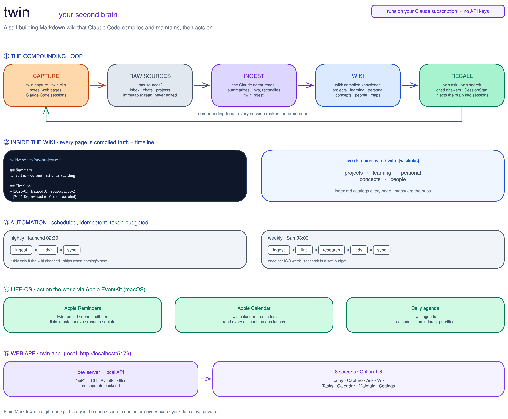

<div align="center">

# twin

### A second brain that builds itself.

twin turns Claude Code into a disciplined wiki maintainer. You feed it sources and work
normally; it compiles a persistent, interlinked Markdown knowledge base that you fully own,
then acts on it (reminders, calendar, a live web UI). No database, no API keys, no vendor lock-in.

[](LICENSE)




</div>

---

Based on Andrej Karpathy's [LLM Wiki](https://gist.github.com/karpathy/442a6bf555914893e9891c11519de94f)
pattern, with [kepano/obsidian-skills](https://github.com/kepano/obsidian-skills) for Obsidian formats.

> Obsidian is the IDE. The LLM is the programmer. The wiki is the codebase.

## Contents

- [Why it is different](#why-it-is-different)
- [Features](#features)
- [Quick start](#quick-start)
- [The CLI](#the-cli)
- [The web app](#the-web-app)
- [Life-OS: calendar and reminders](#life-os-calendar-and-reminders)
- [Automation: nightly and weekly](#automation-nightly-and-weekly)
- [Running on your Claude subscription (no API tokens)](#running-on-your-claude-subscription-no-api-tokens)
- [How it works](#how-it-works)
- [Privacy](#privacy)
- [License](#license)

## Why it is different

Most "AI + notes" setups are RAG: they re-derive answers from raw chunks on every query, and
nothing compounds. twin compiles instead. The LLM integrates each new source into existing pages,
wires `[[wikilinks]]`, reconciles contradictions, and keeps a catalog current. The wiki becomes a
compounding artifact you can open in [Obsidian](https://obsidian.md) and browse as a graph, not a
pile of embeddings you can never read.

Every page follows one pattern: a **compiled-truth summary** (rewritten as understanding evolves)
on top of a **dated, append-only timeline** (so history stays auditable). Git is the undo button.

## Features

| | |
|---|---|
| **Self-building wiki** | Drop sources in; the agent files, links, dedupes, and summarizes them into the right domain. |
| **Auto-capture from your work** | A SessionStart hook injects relevant context into new Claude Code sessions; a SessionEnd hook backs up sessions. Per-project opt-in, so private projects stay private. |
| **Compiled truth + timeline** | Current best understanding plus the dated history of how it was learned, on every page. |
| **Maps of Content** | Pages auto-sort into navigation hubs that scale to thousands of notes. |
| **Live web app** | A local React UI over the real vault: Today briefing, Capture, Ask, Wiki reader, Tasks, Calendar, Maintain, Settings. |
| **Life-OS** | Read and write Apple Reminders and read all your Apple Calendars via EventKit, with a daily briefing. |
| **Hybrid search** | `twin search` runs semantic (vector) + keyword search via qmd, falling back to grep. |
| **Web research** | `twin clip <url>` pulls clean Markdown (defuddle); the weekly pass fills knowledge gaps from the web, cited. |
| **Token-budgeted automation** | Nightly + weekly jobs that skip when nothing changed, run mechanical work on a cheap model, and only reason with the smart one. |
| **Yours and safe** | Plain Markdown in a git repo. A secret scan runs before every push. |

## Quick start

Requires [Claude Code](https://claude.com/product/claude-code), `git`, and `python3`. The web app
and Life-OS features additionally want Node.js (`npm`) and, on macOS, the Xcode Command Line Tools
(`swift`).

```bash
git clone https://github.com/Arsh-S/twin-brain.git
cd twin-brain
./install.sh --with-skills        # add --dir PATH to choose where the brain lives (default ~/twin)
```

This creates your vault, puts `twin` on your PATH, installs the Claude Code hooks, copies the web
app and Swift helpers in, and schedules the nightly/weekly jobs (macOS). **Your knowledge lives in
the vault, separate from this framework repo**, so you can keep it private.

## The CLI

```bash
twin capture "a thought"                # drop into the inbox
twin clip https://example.com/article   # web page -> clean markdown
twin ingest                             # compile inbox + sessions into the wiki
twin ask "what do I know about X?"       # cited answer from the wiki
twin search "topic"                     # hybrid semantic + keyword search
twin tidy                               # cheap mechanical clean + sort into MOCs
twin lint                               # deep reconcile + health audit
twin research 3                         # fill ~3 web-research gaps (soft target)
twin remind "call the dentist" --due "June 20, 2026 9:00 AM"   # Apple Reminder
twin agenda                             # briefing: calendar + reminders + priorities
twin app                                # launch the web UI (http://localhost:5179)
twin doctor                             # health check: deps, permissions, schedule, sync
twin status
```

In any other repo, Claude Code offers (once) to track that project in twin. Tracked projects get
captured automatically; private ones never are.

## The web app

`twin app` boots a local React + TypeScript front-end over your live vault (no mock data). Because
a browser cannot run EventKit, Swift, or claude, the **Vite dev server doubles as the backend**:
every `/api/*` request shells out to the `twin` CLI, the Swift EventKit helpers, or reads the vault
files directly. The dev server is the app, so there is nothing extra to deploy.

```bash
twin app          # or: cd app && npm install && npm run dev
```

Eight screens, reachable with **Option + 1 to 8**:

- **Today** — a briefing from your calendar, open reminders, and `profile.md` priorities, plus a project pulse and live `twin status`.
- **Capture** — a box, drag-and-drop, and file upload that write real inbox notes.
- **Ask** — runs `twin ask` and shows the cited answer.
- **Wiki** — the real `wiki/` tree and a page reader with clickable `[[wikilinks]]`.
- **Tasks** — full Apple Reminders CRUD (add, complete, edit, delete) and list management.
- **Calendar** — every Apple Calendar account in a 7-day strip with a grouped agenda.
- **Maintain** — run ingest / tidy / lint / research / sync / agenda, with a `twin doctor` health table.
- **Settings** — light/dark and editorial/console themes, plus the per-project capture-policy registry.

## Life-OS: calendar and reminders

twin can act on the world, not just remember it. On macOS it talks to **Apple EventKit** directly,
so it reaches every account with no per-account OAuth and never launches the Calendar or Reminders
apps:

- `twin remind "..."` and `twin remind done|edit|rm "match"` create, complete, edit, and delete **Apple Reminders**. The web app adds list management (create, rename, move between lists, delete).
- `twin reminders` and `twin calendar [days]` read open reminders and events across all accounts.
- `twin agenda` writes a daily briefing (calendar + reminders + your `profile.md` priorities) into `generated/`.
- `ingest` turns clear action items in your notes and sessions into reminders automatically.
- Calendar **writes** (optional) go through a calendar MCP to a single calendar you designate.

First run prompts once for Calendar and Reminders permission (System Settings, Privacy); grant your
terminal. `twin doctor` verifies access.

## Automation: nightly and weekly

Two scheduled bundles keep the brain current without you thinking about it (macOS `launchd`, or cron
elsewhere):

- **nightly** — `ingest` new sources, `tidy` (only if the wiki actually changed), then `sync`. On a
  quiet day it does almost nothing.
- **weekly** — `ingest`, then `lint` (deep reconcile + health audit), `research` (soft-budgeted web
  gap-fill), `tidy`, and `sync`.

Both are **idempotent**: they stamp a last-run marker and skip if already run this day or ISO week.
`launchd` fires them on schedule and again at login, so a run missed because the Mac was off is
caught up exactly once on next login, never double-run. Pass `--force` to override.

## Running on your Claude subscription (no API tokens)

twin's engine is the `claude` CLI you are already logged into, so it runs on your **Claude Code
subscription with no API keys and no metered billing**. It is built to be frugal with that quota:

- **Delta guards** — the nightly job spends roughly zero tokens on days nothing changed, and skips
  `tidy` unless the wiki is dirty.
- **Cheap vs smart split** — mechanical passes (`tidy`) run on a cheap model; reasoning (`ingest`,
  `ask`, `lint`, `research`) runs on the smart one. Tune with `TWIN_CHEAP_MODEL`.
- **Soft research budget** — web research targets a small number of gaps per week (default 3),
  exceeding it only for clearly high-value clusters. Tune with `TWIN_RESEARCH_TARGET`.
- **Work on diffs** — agents operate on `git status`/`diff` instead of re-reading the whole vault.

The web app's heavy actions (Ask, Ingest, Lint, Research) spawn that same local engine, so the UI
costs nothing beyond your subscription either.

## How it works

```
capture --> raw-sources/ --> ingest (Claude) --> wiki/ --> ask / SessionStart recall
   ^             (immutable)        (compiles)     (the brain)            |
   +------------------------ compounding loop ------------------------------+
                nightly: ingest + tidy + sync   .   weekly: + lint + research
```

- `raw-sources/` — immutable inputs (you write; the agent only reads and moves).
- `wiki/` — agent-owned compiled knowledge (`projects/ learning/ personal/ concepts/ people/ maps/`).
- `generated/` — one-off AI outputs (briefings, drafts); never hand-edited, kept out of the wiki.
- `skills/` — the prompts that define ingest / ask / lint / tidy / research / agenda behavior.
- `app/` — the local web UI and its dev-server API bridge.
- `bin/` — the `twin` CLI plus the Swift EventKit helpers.
- `CLAUDE.md` — the schema that makes the agent a disciplined maintainer.

For a from-the-code walkthrough (engine, app API map, EventKit helpers, automation), see
[docs/ARCHITECTURE.md](docs/ARCHITECTURE.md).

## Privacy

This framework repo contains only functionality, never personal content. **Your vault holds your
data; keep it in a private repo, or no remote at all.** A secret scan (API keys, tokens, private
keys) runs before every `twin sync` and aborts the push if it finds anything. The SessionEnd hook
skips private projects and twin's own directory.

## License

MIT, see [LICENSE](LICENSE).
